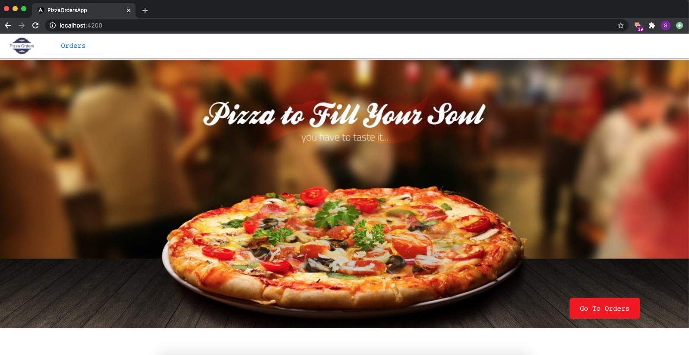
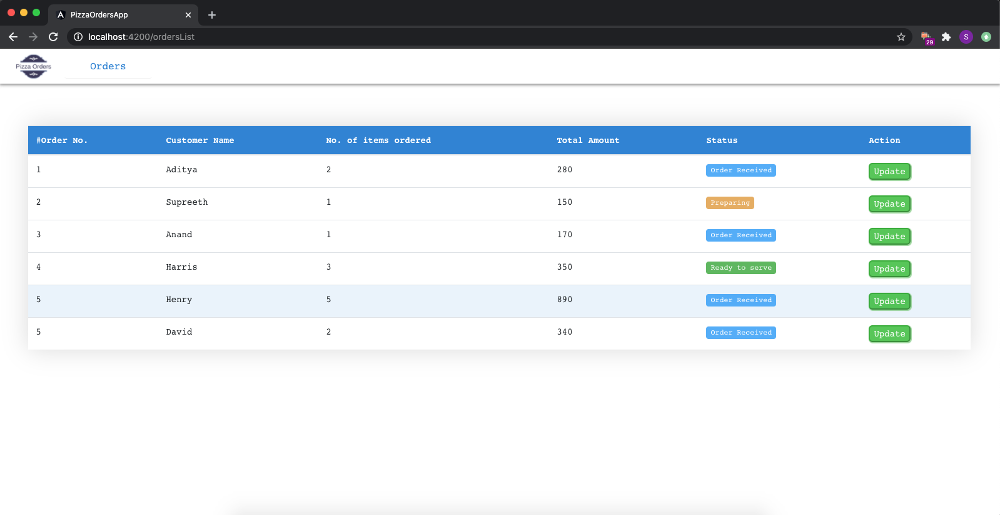
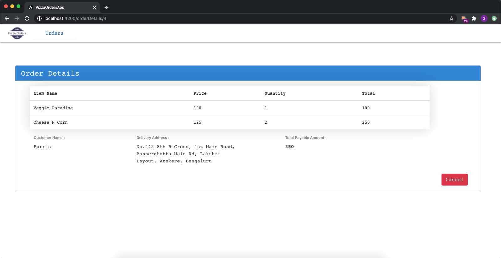

# Images :

# Error Case: If there is @angular-devkit/build-angular/package.json Error
Run npm install --save-dev @angular-devkit/build-angular

# PizzaOrdersApp

This project was generated with [Angular CLI](https://github.com/angular/angular-cli) version 10.1.3.

## Development server

Run `ng serve` for a dev server. Navigate to `http://localhost:4200/`. The app will automatically reload if you change any of the source files.
